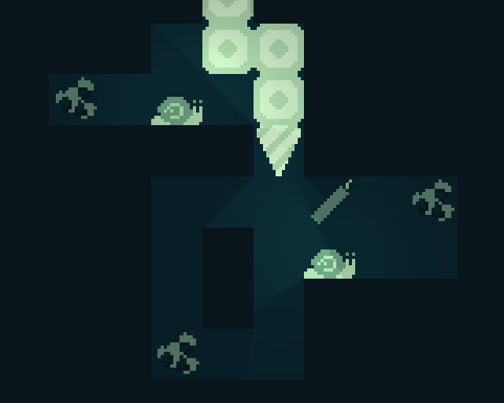

# Drillydown

Harvest treasures of the underground in this small snake-inspired puzzle game.

Move using `W`, `A`, `S`, `D` or the arrow keys.  
Restart the level using the `R` key.

Most levels have more than one solution.

---

Made in [Godot](https://godotengine.org) 4.0 beta 10 for Ludum Dare 52 (48 hours).  
The game can be played here: https://ldjam.com/events/ludum-dare/52/drillydown  
The source code can be found here: https://github.com/95jonpet/ld52